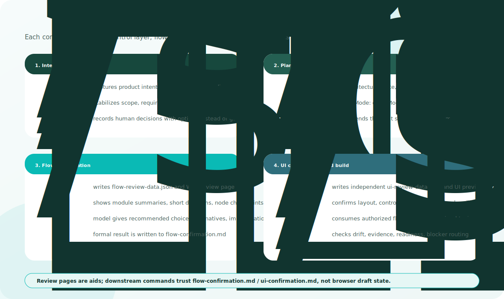
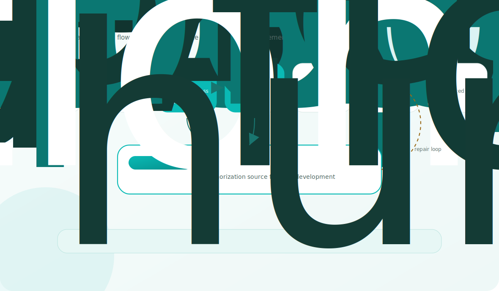

<div align="center">
    <h1>SpecCompass</h1>
    <h3><em>Spec-driven development for AI coding agents, with visual confirmation before implementation.</em></h3>
</div>

SpecCompass is an enhanced fork of [github/spec-kit](https://github.com/github/spec-kit). It keeps the upstream installation and agent integrations, then adds a layered control loop for AI-assisted software work.

The core idea: do not let an agent jump from intent to code. Clarify direction first, show the flow and UI for human confirmation, then implement only the confirmed scope with evidence.

Chinese documentation: [README.zh-CN.md](./README.zh-CN.md)





## What changes

SpecCompass turns specifications into a control mechanism for agent work:

- **Intent before execution**: product goals, constraints, and missing decisions are captured before planning
- **Smart routing**: when you do not know the next step, run `/sp.route`; it reads project state, uses the agent to choose the next safe command, and avoids guesswork
- **Visible review before code**: flow and UI are shown in Web review pages before implementation
- **Recommended choices**: the agent proposes options, consequences, and a recommended decision
- **Authorization records**: confirmed flow and UI decisions become the source for later work
- **Bounded implementation**: coding starts from selected tasks, declared scope, and current verification evidence

## How work moves

1. Capture product intent with `/sp.prd`, `/sp.specify`, and `/sp.clarify`
2. When unsure what to do next, run `/sp.route` to recover direction and get the next safe command
3. Generate or refresh business and architecture flows with `/sp.flow`, then review and confirm them visually
4. Generate or refresh screen structure and interaction choices with `/sp.ui`, then review and confirm the UI preview
5. Prepare the delivery boundary with `/sp.bundle`, `/sp.plan`, and `/sp.tasks`
6. Close the document chain before coding: `/sp.analyze` checks evidence, then `/sp.gate` authorizes the stage
7. Implement only authorized work with `/sp.implement`

This keeps human judgment at the points where it matters, while keeping the agent focused on work it can verify.

## Operating guardrails

`/sp.route y` is only a safe continuation shortcut. It relies on `speckit.route.v1`, `continueAllowed`, `fallback-log.md`, and the `REPEATED_FALLBACK` stop rule; human decisions and unclear blockers route back to `/sp.clarify`.

Implementation review starts from the `Delta Summary`, current diff, task packet, trace/open-items, and the task `Read Set` before broader source reading.

For controlled multi-agent work, one coordinator assigns eligible worksets, workers submit `Delta Summary` and `Proposed Updates`, and failures fall back to single-agent recovery.

## Visual confirmation

`/sp.flow` first generates or refreshes the business and architecture flow artifacts, then creates a review page for modules, process diagrams, decision points, and recommended choices.

`/sp.ui` first generates or refreshes the screen map, page structure, UI regions, controls, states, and key interaction choices, then creates a review page for visual confirmation.

Both pages use a right-side review rail. Reviewers can accept the recommendation or submit another choice with comments. The browser page helps review the decision; the generated confirmation document is what authorizes later implementation.

Review page examples:


## Start using SpecCompass

Install the SpecCompass fork:

```bash
uv tool install specify-cli --from git+https://github.com/flyfoxai/SpecCompass.git
```

Create a Codex-ready project:

```bash
specify init my-project --integration codex
cd my-project
specify check
```

In Codex, use `$sp-*` skills as the stable entry point, for example `$sp-plan`, `$sp-flow`, and `$sp-ui`.

## Read more

README stays focused on the implementation idea. The detailed rules for PRD intake, flow/UI confirmation, implementation readiness, blocker closeout, verification, and multi-agent coordination live in [SP Project Methodology](./docs/reference/sp-project-methodology.md).

SpecCompass keeps the upstream Spec Kit installation style where practical. For users, this repository is the install target: install SpecCompass, initialize a project, then use `/sp.*` on slash-command hosts or `$sp-*` skills in Codex.

## License

This project follows the upstream Spec Kit license. See [LICENSE](./LICENSE).
