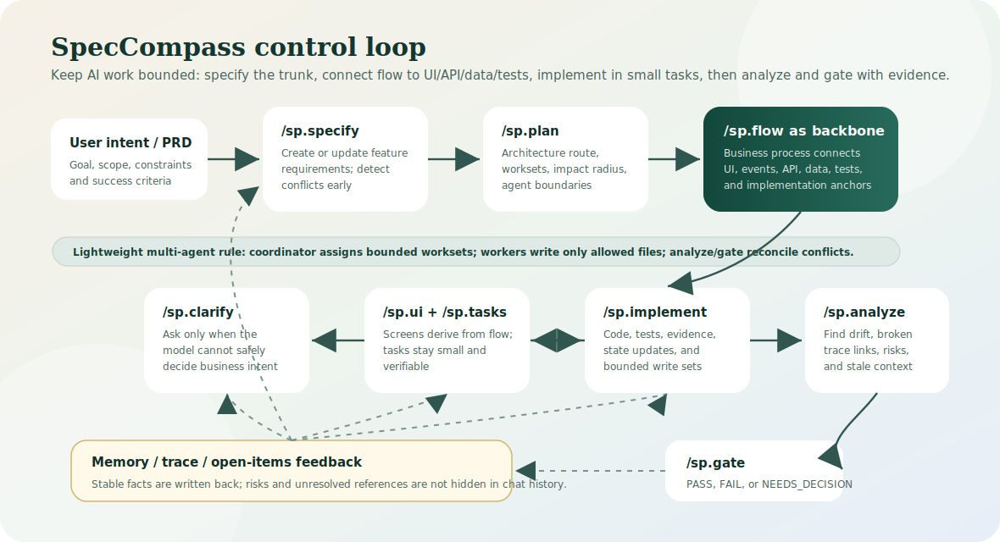

<div align="center">
    <h1>SpecCompass</h1>
    <h3><em>Spec-Driven Development for AI coding agents, with layered planning, memory, and verification.</em></h3>
</div>

SpecCompass is an enhanced fork of [github/spec-kit](https://github.com/github/spec-kit) for **AI-assisted Spec-Driven Development** with coding agents such as Codex, Claude, and Gemini. It keeps the proven Spec Kit installation and integration mechanics, while adding layered planning, project memory, context-window management, traceability, verification discipline, and safer fallback rules for complex software projects.

The principle is simple: keep the proven upstream Spec Kit "bottle" as intact as possible, including the directory skeleton, template shell, CLI installation flow, integration framework, and script entry points. SP changes the "water" inside that bottle by adding richer content for complex projects and AI-assisted development.

Chinese documentation: [README.zh-CN.md](./README.zh-CN.md)



## Why This Fork Exists

Upstream Spec Kit has a stable installation and runtime mechanism. In larger AI coding projects, however, plain `spec`, `plan`, and `tasks` can still be too thin when the model must coordinate requirements, architecture, UI, APIs, data, tests, and delivery evidence across many files.

Common problems SP tries to reduce:

- The model loses context, rereads too much, or misses important facts.
- Requirements, UI, workflows, APIs, tables, permissions, and acceptance checks drift apart.
- Risks, blockers, and pending decisions do not have a stable place to live.
- Stale documents can mislead the model into continuing down the wrong path.
- Large features are not split early enough, so the agent's attention window becomes overloaded.
- Failed checks, unclear requirements, or conflicting decisions can push an agent into repeated guessing instead of a controlled recovery route.

SP is packaged as a standalone enhanced edition. Users install and use this fork directly; no separate upstream alignment step is required.

It is designed for developers who want a more controlled AI software engineering workflow: use specs to define intent, use plans and tasks to constrain implementation, use memory and trace files to reduce repeated context loading, and use analyze/gate commands to catch drift before code changes continue.

## Methodology

SP treats AI development as an engineering control loop, not a one-shot prompt. The goal is to give the agent enough context to work accurately, but not so much that the context window becomes noisy or expensive.

The methodology is documented in [SP Project Methodology](./docs/reference/sp-project-methodology.md). In short:

- Start from the trunk: clarify goals, scope, success criteria, constraints, and the active feature before expanding into implementation details.
- Keep context small but sufficient: route through project memory, feature memory, worksets, trace files, and directly related source docs before reading the whole repository.
- Use stable anchors and searchable IDs for features, worksets, UI, APIs, risks, tests, and acceptance paths, so later agents can find related content without recomputing the whole project.
- Track unresolved work explicitly in `memory/open-items.md`, including risks, blockers, decisions, owners, close conditions, and revisit points.
- Use lightweight impact-radius checks before changing APIs, permissions, data, event flows, UI contracts, or core tests.
- Let `/sp.analyze` find drift and `/sp.gate` decide phase readiness; do not let the model mark risky or unclear states as PASS without evidence.
- Route failures upward instead of guessing: clarify requirements, repair specs, adjust plans, split oversized worksets, or ask the user for a decision with clear options.
- Borrow CodeGraph-style ideas such as stable nodes, explicit relationships, and impact queries as lightweight methodology, without making a heavy code graph runtime a default dependency.

## How The Mechanism Works

SpecCompass keeps the workflow readable for humans and predictable for agents:

- Requirements enter through `/sp.specify`. New or changed requirements are checked for conflicts instead of being silently merged into stale specs.
- When intent is unclear, `/sp.clarify` asks focused questions with plain-language options and records the decision so later agents do not need to rediscover it.
- `/sp.plan` defines the technical route, worksets, impact radius, and agent boundaries before code changes begin.
- `/sp.flow` is the backbone. Business flows connect process nodes to UI screens, events, API calls, data objects, tests, and code anchors.
- `/sp.ui` runs after flow: it collects the elements needed by each screen and turns process-bound elements into a coherent interface.
- `/sp.tasks` keeps implementation small. Each task should have a clear scope, expected evidence, and a bounded write area.
- `/sp.implement` writes code with verification evidence and updates stable state only when facts, risks, or unresolved items actually change.
- `/sp.analyze` and `/sp.gate` close the loop: they detect drift, broken trace links, stale context, unresolved risks, and phase-readiness failures.
- For multi-agent work, one coordinator assigns worksets, workers stay inside declared write boundaries, and analyze/gate reconcile outputs before the project moves on.

The intended result is not heavier ceremony. The intended result is fewer dead ends: when the agent cannot proceed safely, it moves upward to the right phase, explains the situation, and asks for a decision instead of inventing one.

## What SP Adds

- Upstream-style `specify init`, templates, scripts, and agent integrations.
- User-facing core commands use the `sp.*` namespace, for example `/sp.specify`, `/sp.plan`, and `/sp.analyze`.
- Codex uses skills as the stable entry point. It installs executable skills in `.agents/skills/sp-*/SKILL.md` and does not rely on deprecated custom slash commands or prompt/plugin command surfaces.
- Claude and markdown-style hosts expose direct slash commands such as `/sp.analyze` through their normal command directories.
- Layered artifacts for flow, UI, delivery, memory, trace, open items, and gates.
- Flow-first relationship management: business process nodes become the preferred link between requirements, UI, actions, API, data, tests, and code.
- Stable coding and anchor rules for features, worksets, UI, APIs, risks, tests, and trace links, so the model can search and update related content without rereading everything.
- Project memory for active context, feature map, hotspots, open items, and trace index, with rules for when to write back and when to avoid repeated checks.
- Context-budget rules that favor current worksets, direct dependencies, related tests, and trace links before broad repository reads.
- Impact-radius discipline for high-risk changes, including APIs, permissions, data migrations, event flows, UI contracts, and core tests.
- Stronger `/sp.analyze`, `/sp.gate`, and `/sp.implement` rules for evidence checks, risk closure, fallback routing, headless failure reports, and memory updates.
- Guardrails for unclear or conflicting requirements: ask for a decision, route back to the right `/sp.*` phase, and avoid guessing through business contradictions.
- Better support for splitting complex domains before the model context becomes too large.
- Lightweight multi-agent coordination: workset ownership, allowed write sets, shared-state serialization, stale-worker detection, and reconciliation checks.

## Install

Install the SP fork:

```bash
uv tool install specify-cli --from git+https://github.com/flyfoxai/SpecCompass.git
```

Upgrade an existing installation:

```bash
uv tool install specify-cli --force --from git+https://github.com/flyfoxai/SpecCompass.git
```

Verify:

```bash
specify version
specify check
```

## Use With Codex

Create a new project:

```bash
specify init my-project --integration codex
cd my-project
```

Initialize an existing project:

```bash
cd /path/to/your/project
specify init . --integration codex
```

If the current environment does not have the target agent CLI installed, or you only want to install the templates first:

```bash
specify init . --integration codex --ignore-agent-tools
```

For Codex, do not use slash-menu visibility for `/sp.*` as the install success criterion. Current Codex versions use skills as the stable entry point.

In Codex, type `$` or run `/skills`, then choose:

```text
$sp-specify
$sp-plan
$sp-tasks
$sp-analyze
$sp-implement
$sp-gate
$sp-ui
```

Installation acceptance checks:

```bash
specify version
specify check
test -d .agents/skills
test -f .agents/skills/sp-plan/SKILL.md
test -f .agents/skills/sp-analyze/SKILL.md
```

If an older project already contains `.codex/prompts/sp.*`, `plugins/sp/`, or `.agents/plugins/marketplace.json` from an experimental SP install, rerun `specify init . --integration codex` to refresh the integration. Current Codex support keeps the skills and removes those obsolete command surfaces.

## Core Commands

| Command | Purpose |
| --- | --- |
| `/sp.constitution` or `$sp-constitution` in Codex | Create or update project principles, engineering constraints, and governance rules |
| `/sp.specify` or `$sp-specify` in Codex | Create a feature specification: what to build and why |
| `/sp.clarify` or `$sp-clarify` in Codex | Clarify unclear requirements and record decisions |
| `/sp.plan` or `$sp-plan` in Codex | Create the technical plan, architecture choices, and implementation route |
| `/sp.flow` or `$sp-flow` in Codex | Create or refresh business flows, state flows, and sequence flows |
| `/sp.ui` or `$sp-ui` in Codex | Create or refresh screens, screen maps, forms, and interaction notes |
| `/sp.tasks` or `$sp-tasks` in Codex | Break the plan into executable tasks |
| `/sp.analyze` or `$sp-analyze` in Codex | Check consistency and completeness across specs, plans, tasks, flow, UI, delivery, and memory |
| `/sp.gate` or `$sp-gate` in Codex | Decide whether the current state can safely move to the next phase |
| `/sp.implement` or `$sp-implement` in Codex | Execute tasks with verification and necessary memory updates |
| `/sp.bundle` or `$sp-bundle` in Codex | Package the current feature documents for review or delivery |
| `/sp.checklist` or `$sp-checklist` in Codex | Generate quality checklists for the current feature |

## Relationship With Upstream

SP comes from [github/spec-kit](https://github.com/github/spec-kit) and keeps its proven installation and workflow style where practical. For users, this repository is the install target: install SP, initialize a project, then use the host-appropriate SP entry point: `/sp.*` on slash-command hosts and `$sp-*` skills on Codex.

## License

This project follows the upstream Spec Kit license. See [LICENSE](./LICENSE).
