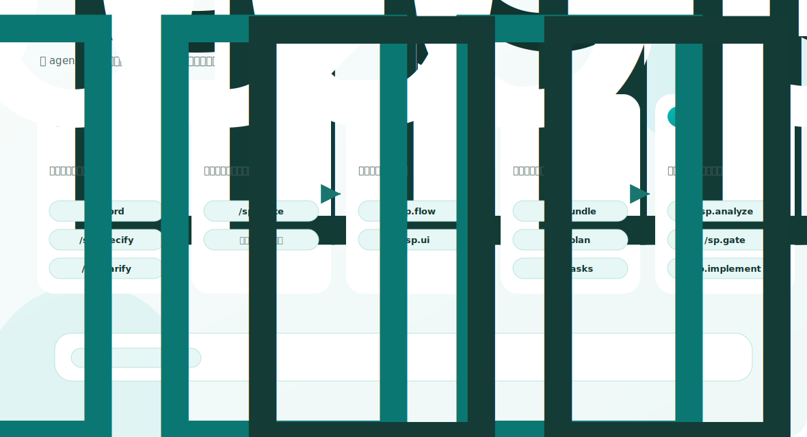
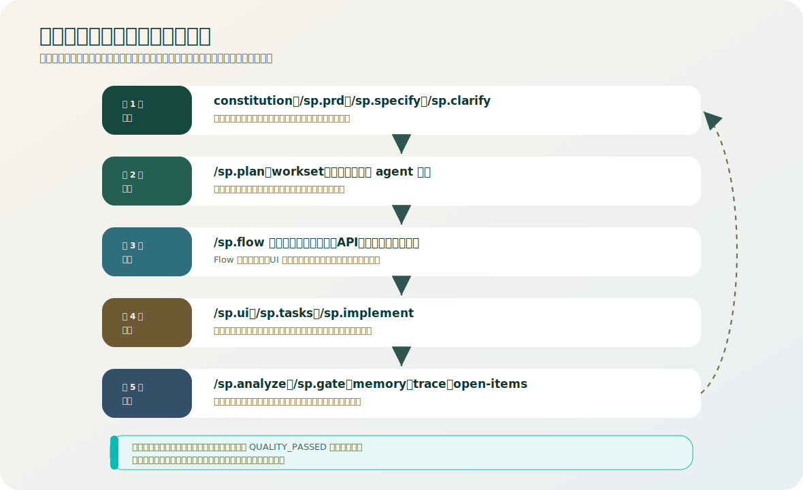

<div align="center">
    <h1>SpecCompass</h1>
    <h3><em>面向 AI 编程 Agent 的规格驱动开发：增强分层规划、记忆和验证。</em></h3>
</div>

SpecCompass 是基于 [github/spec-kit](https://github.com/github/spec-kit) 的增强 fork，面向 **AI 辅助规格驱动开发**，适合 Codex、Claude、Gemini 等编程 agent 使用。它保留 Spec Kit 已经验证稳定的安装和集成机制，同时增强分层规划、项目记忆、上下文窗口管理、关联追踪、验证纪律和稳健兜底规则，更适合复杂软件项目。

我们的原则很简单：尽量保留原版 Spec Kit 已经验证稳定的“瓶子”，包括目录骨架、模板外壳、CLI 安装流程、integration 框架和脚本入口；只替换里面的“水”，让它更适合复杂项目和大模型协作。

英文版说明见 [README.md](./README.md)。





## 为什么要改

原版 Spec Kit 的安装和运行机制很稳定，但在复杂 AI 编程项目里，模型需要同时处理需求、架构、界面、接口、数据、测试和交付证据，单靠 spec、plan、tasks 往往不够。

SP 主要想解决这些问题：

- 上下文太大，模型容易读漏、读重。
- 需求、界面、流程、接口、表、权限、验收容易脱节。
- 风险、待办、阻塞项没有固定位置，下一轮容易忘。
- 文档过期后，模型还可能继续沿着旧路线执行。
- 大功能没有提前拆分，导致 agent 的注意力窗口被压满，准确性下降。
- 检查失败、需求不清或决策冲突时，agent 容易反复猜测，而不是回到正确层级修复。

SP 是可以单独安装和使用的增强版。用户不需要再手动下载原版，也不需要自己做“对齐原版”的操作。

它适合希望把 AI 编程流程管得更稳的开发者：用规格明确目标，用计划和任务约束实现，用 memory 和 trace 减少重复加载上下文，用 analyze/gate 在继续编码前发现偏移。

## 方法论

SP 把 AI 开发看成一个工程控制闭环，而不是一次性 prompt。目标是给 agent 足够完成工作的上下文，但不要让上下文窗口被无关信息塞满，导致 token 浪费和判断失准。

完整方法论见 [SP 项目的方法论](./docs/reference/sp-project-methodology.md)。简要来说：

- 先确定主干：先明确目标、范围、成功标准、约束和 active feature，再展开实现细节。
- 上下文要小而充分：优先通过项目 memory、feature memory、workset、trace 和直接相关 source docs 进入，不默认全仓读取。
- 用稳定锚点和可搜索编码标记 feature、workset、UI、API、风险、测试和验收路径，减少后续 agent 重复推理。
- 把未解决事项明确写入 `memory/open-items.md`，包括 risk、blocker、decision、owner、关闭条件和回看点。
- 对 API、权限、数据、事件流、UI 契约、核心测试等高风险改动，先做轻量影响半径检查。
- `/sp.analyze` 负责发现漂移，`/sp.gate` 负责阶段准入；没有证据时，模型不能把高风险或不清楚的状态标成 PASS。
- 失败时向上兜底，而不是继续猜：回到 clarify、spec、plan、tasks，必要时拆分过大的 workset，或者用说人话的选项让用户决策。
- 借鉴 CodeGraph 的稳定节点、显式关系和影响查询思想，但只作为轻量方法论，不把重型代码图运行时作为默认依赖。

## 机制如何运转

SpecCompass 的目标是让人看得懂，也让 agent 执行时不容易跑偏：

- 需求从 `/sp.specify` 进入。新增或变更需求要先检查冲突，不能直接混进旧规格里。
- 意图不清时，`/sp.clarify` 用说人话的方式给出选项，并把决策记录下来，避免后续 agent 重新猜。
- `/sp.plan` 在编码前确定技术路线、workset、影响半径和 agent 边界。
- `/sp.flow` 是主轴。业务流程节点把界面、事件、API、数据对象、测试和代码锚点连接起来。
- `/sp.ui` 在 flow 之后运行：先收集每个界面需要承载的流程元素，再把它们拼成合理界面。
- `/sp.tasks` 把工作拆小，每个任务都应该有明确范围、验证证据和允许写入区域。
- `/sp.implement` 负责编码、验证和必要回写；只有稳定事实、风险或未决项变化时才写 memory。
- `/sp.analyze` 和 `/sp.gate` 负责收口：检查漂移、断链、过期上下文、未闭环风险和阶段准入。
- 多 agent 协作时，由 coordinator 分配 workset，worker 只写允许范围，最后由 analyze/gate 合并检查，避免互相覆盖。

这套机制不是为了增加形式主义，而是为了减少死胡同：当 agent 不能安全继续时，要向上回到正确阶段，说明背景和影响，给用户可选方案，而不是自己编一个答案继续做。

## 修改后的优势

- 仍然使用 upstream 风格的 `specify init`、模板、脚本和 agent integration。
- 用户可见命令统一使用 `sp.*` 命名空间，例如 `/sp.specify`、`/sp.plan`、`/sp.analyze`。
- Codex 的稳定入口是 skills：可执行 skill 包安装在 `.agents/skills/sp-*/SKILL.md`，不再依赖已经废弃的 custom slash commands 或 prompt/plugin 命令面。
- Claude 和 markdown 命令类宿主通过自己的命令目录直接显示 `/sp.analyze` 这类命令。
- 新增 flow、ui、delivery、memory、trace、open-items 等分层文档，帮助模型按最小上下文工作。
- 强化 Flow-first 关联管理：业务流程节点优先连接需求、界面、动作、API、数据、测试和代码。
- 增加稳定编码和锚点规则，用来标记 feature、workset、UI、API、风险、测试和 trace 关系，方便模型快速搜索和定位关联内容。
- 增加项目级 memory，包括 active context、feature map、hotspots、open items、trace index，减少重复读取和重复判断。
- 增加上下文预算规则，优先读取当前 workset、直接依赖、相关测试和 trace 链路，再决定是否扩大范围。
- 增加影响半径纪律，重点约束 API、权限、数据迁移、事件流、UI 契约和核心测试等高风险改动。
- 明确什么时候必须回写状态，什么时候不要重复检查，降低 token 浪费。
- `/sp.analyze`、`/sp.gate`、`/sp.implement` 加强了证据检查、风险闭环、向上兜底、headless 失败报告和实现后回写。
- 对需求不清、需求冲突、阶段走错的情况，要求模型回到合适的 `/sp.*` 阶段，必要时给用户可选方案，而不是继续猜。
- 对大型项目可以提前拆分复杂子域，避免一次任务过大导致注意力失焦。
- 支持轻量多 agent 协作：明确 workset 归属、允许写入范围、共享状态串行化、过期 worker 检测和合并复核。

## 安装

安装到本机工具链：

```bash
uv tool install specify-cli --from git+https://github.com/flyfoxai/SpecCompass.git
```

升级已有安装：

```bash
uv tool install specify-cli --force --from git+https://github.com/flyfoxai/SpecCompass.git
```

检查安装：

```bash
specify version
specify check
```

## 在 Codex 项目中使用

新建项目：

```bash
specify init my-project --integration codex
cd my-project
```

已有项目：

```bash
cd /path/to/your/project
specify init . --integration codex
```

如果当前环境没有目标 agent CLI，或者只想先装模板：

```bash
specify init . --integration codex --ignore-agent-tools
```

对 Codex 来说，不要再用斜杠菜单里是否出现 `/sp.*` 作为安装成功标准。当前 Codex 的稳定入口是 skills。

在 Codex 里输入 `$`，或者运行 `/skills`，然后选择：

```text
$sp-specify
$sp-plan
$sp-tasks
$sp-analyze
$sp-implement
$sp-gate
$sp-ui
```

安装验收建议检查：

```bash
specify version
specify check
test -d .agents/skills
test -f .agents/skills/sp-plan/SKILL.md
test -f .agents/skills/sp-analyze/SKILL.md
```

如果旧项目里已经有早期实验版生成的 `.codex/prompts/sp.*`、`plugins/sp/` 或 `.agents/plugins/marketplace.json`，重新运行 `specify init . --integration codex` 即可刷新集成。当前 Codex 支持会保留 skills，并清理这些过时命令面。

## 常用命令

| 命令 | 作用 |
| --- | --- |
| `/sp.constitution`，Codex 中用 `$sp-constitution` | 建立或更新项目原则、工程约束和治理规则 |
| `/sp.specify`，Codex 中用 `$sp-specify` | 创建 feature 规格，说明要做什么、为什么做 |
| `/sp.clarify`，Codex 中用 `$sp-clarify` | 对不清楚的需求做结构化澄清 |
| `/sp.plan`，Codex 中用 `$sp-plan` | 生成技术方案、架构选择和实施计划 |
| `/sp.flow`，Codex 中用 `$sp-flow` | 生成或刷新业务流程、状态流、时序流 |
| `/sp.ui`，Codex 中用 `$sp-ui` | 生成或刷新界面、页面映射、表单和交互说明 |
| `/sp.tasks`，Codex 中用 `$sp-tasks` | 把方案拆成可执行任务 |
| `/sp.analyze`，Codex 中用 `$sp-analyze` | 检查 spec、plan、tasks、flow、ui、delivery、memory 是否一致和完整 |
| `/sp.gate`，Codex 中用 `$sp-gate` | 判断当前文档状态是否可以继续进入下一阶段 |
| `/sp.implement`，Codex 中用 `$sp-implement` | 按任务执行实现，并要求验证和必要的 memory 回写 |
| `/sp.bundle`，Codex 中用 `$sp-bundle` | 打包当前 feature 的交付文档 |
| `/sp.checklist`，Codex 中用 `$sp-checklist` | 生成质量检查清单 |

## 和原版的关系

SP 来源于 [github/spec-kit](https://github.com/github/spec-kit)，并尽量保留原版稳定的安装和工作流风格。对用户来说，这个仓库就是安装目标：安装 SP，初始化项目，然后按宿主入口使用 SP：支持 slash 命令的宿主用 `/sp.*`，Codex 用 `$sp-*` skills。

## 许可证

本项目遵循原版 Spec Kit 的许可证。见 [LICENSE](./LICENSE)。
