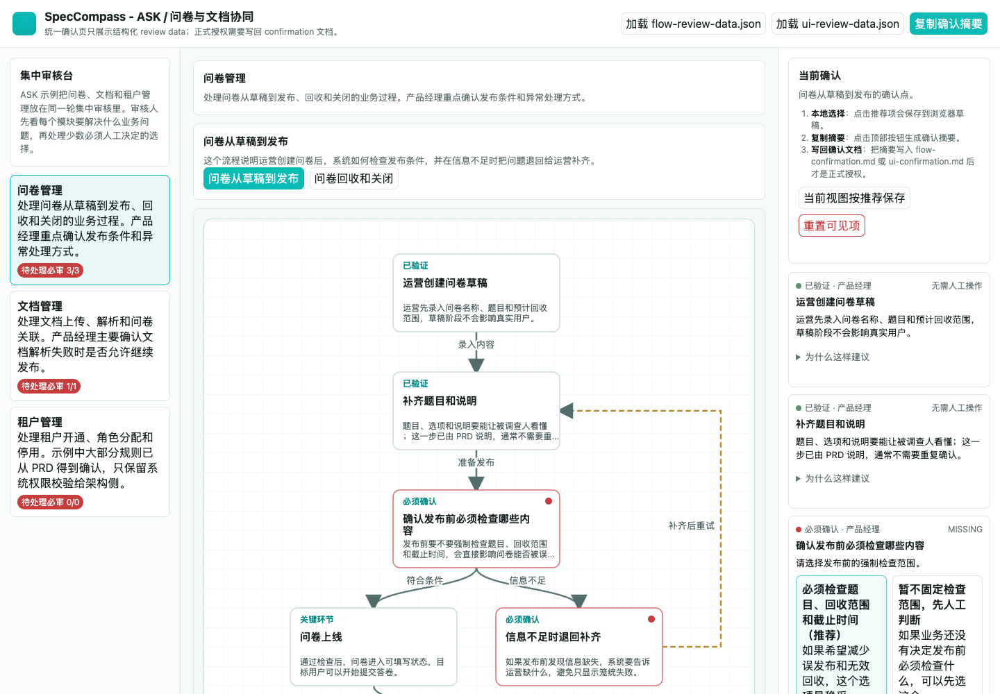
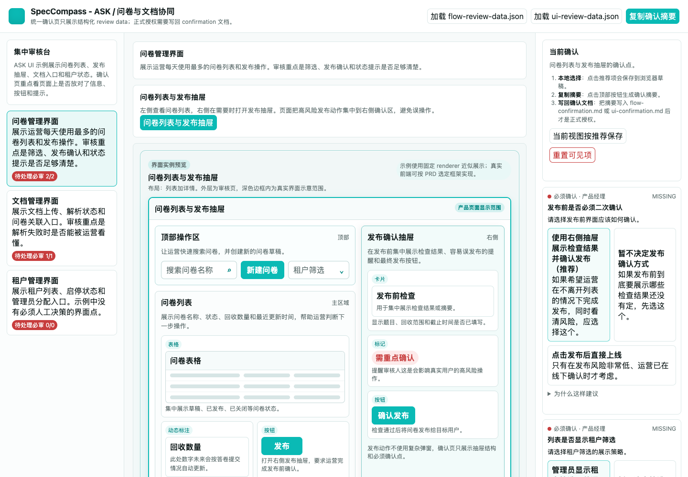

<div align="center">
    <h1>SpecCompass</h1>
    <h3><em>面向 AI 编程 Agent 的规格驱动开发：实现前先做可视化确认。</em></h3>
</div>

SpecCompass 是基于 [github/spec-kit](https://github.com/github/spec-kit) 的增强 fork。它保留上游稳定的安装方式和 agent 集成方式，同时为 AI 辅助开发增加一套分层控制闭环。

核心思想：不要让 agent 从一句需求直接跳到代码。先确认方向，再把 Flow 和 UI 展示给人审阅，最后只按确认过的范围实现，并保留证据。

英文版说明见 [README.md](./README.md)。


## 改变了什么

SpecCompass 把规格文档从记录材料变成 agent 工作的控制机制：

- **先有意图，再执行**：先整理产品目标、约束和缺失决策，再进入规划
- **傻瓜式智能路由**：不知道下一步该做什么时，就运行 `/sp.route`；它会读取项目现状，调用模型能力判断下一条安全命令，避免靠猜
- **先可视化确认，再写代码**：Flow 和 UI 都要在 Web 审核页中展示
- **提供推荐选择**：模型用人话说明每个选项什么时候选、选择后模型会改什么、会影响哪些范围/排期/风险/实现/测试
- **形成授权记录**：确认后的 Flow 和 UI 结果成为后续开发依据
- **限制实现边界**：编码从明确任务、声明范围和当前验证证据开始

## 工作如何推进

1. 用 `/sp.prd`、`/sp.specify`、`/sp.clarify` 整理产品意图
2. 不知道下一步该做什么时，运行 `/sp.route` 恢复方向并得到下一条安全命令
3. 用 `/sp.flow` 生成或刷新业务流程和架构流程，再进行可视化审核确认
4. 用 `/sp.ui` 生成或刷新界面结构和交互选择，再审核确认界面预览
5. 用 `/sp.bundle`、`/sp.plan`、`/sp.tasks` 准备交付边界
6. 实现前先收口：`/sp.analyze` 检查证据，`/sp.gate` 再决定是否准入
7. 用 `/sp.implement` 只实现已授权内容

这样可以把人工判断集中放在关键节点，让 agent 只处理已经明确且可以验证的工作。

## 操作护栏

`/sp.route y` 只是安全续跑入口。它依赖 `speckit.route.v1`、`continueAllowed`、`fallback-log.md` 和 `REPEATED_FALLBACK` 停止规则；人工决策和不清楚的阻塞要回到 `/sp.clarify`。

实现审查先看 `Delta Summary`、当前 diff、任务包、trace/open-items 和任务 `Read Set`，再按需要扩大源码阅读范围。

受控多 agent 协作时，由 coordinator 分配符合条件的 workset，worker 提交 `Delta Summary` 和 `Proposed Updates`，失败时兜底到单 agent 恢复路线。

## 可视化确认

`/sp.flow` 先生成或刷新业务流程、架构流程和相关流程产物，再生成流程审核页，用来查看模块、流程图、判断点和推荐选项。

`/sp.ui` 先生成或刷新页面地图、界面结构、区域、控件、状态和关键交互选择，再生成界面审核页，用来进行可视化确认。

两个审核页都使用右侧确认栏。审核人可以接受推荐，也可以提交结构化的自然语言修改请求。推荐选项必须说清背景、下一步模型动作、后续影响和推荐理由。浏览器确认页不是编辑器；真正授权后续模型修订和实现的是生成的确认文档。

确认页示例：





## 开始使用

安装 SpecCompass fork：

```bash
uv tool install specify-cli --from git+https://github.com/flyfoxai/SpecCompass.git
```

创建 Codex 项目：

```bash
specify init my-project --integration codex
cd my-project
specify check
```

Codex 中稳定的入口是 `$sp-*` skills，例如 `$sp-plan`、`$sp-flow`、`$sp-ui`。

## 进一步阅读

README 只说明实现思想。PRD 入口、Flow/UI 确认、实现准入、阻塞闭环、验证纪律和多 agent 协作的详细规则，见 [SP 项目的方法论](./docs/reference/sp-project-methodology.md)。

SpecCompass 尽量保留上游 Spec Kit 的安装风格。对用户来说，这个仓库就是安装目标：安装 SpecCompass，初始化项目，然后在支持 slash 命令的宿主中使用 `/sp.*`，或在 Codex 中使用 `$sp-*` skills。

## 许可证

本项目遵循原版 Spec Kit 的许可证。见 [LICENSE](./LICENSE)。
