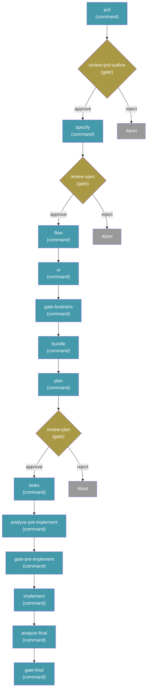

# Workflows

Workflows automate multi-step Spec-Driven Development processes — chaining commands, prompts, shell steps, and human checkpoints into repeatable sequences. They support conditional logic, loops, fan-out/fan-in, and can be paused and resumed from the exact point of interruption.

## Run a Workflow

```bash
specify workflow run <source>
```

| Option              | Description                                              |
| ------------------- | -------------------------------------------------------- |
| `-i` / `--input`    | Pass input values as `key=value` (repeatable)            |

Runs a workflow from a catalog ID, URL, or local file path. Inputs declared by the workflow can be provided via `--input` or will be prompted interactively.

Example:

```bash
specify workflow run speckit -i spec="Build a kanban board with drag-and-drop task management" -i scope=full
```

> **Note:** All workflow commands require a project already initialized with `specify init`.

## Resume a Workflow

```bash
specify workflow resume <run_id>
```

Resumes a paused or failed workflow run from the exact step where it stopped. Useful after responding to a gate step or fixing an issue that caused a failure.

## Resume an Agent Session

For day-to-day agent sessions outside a persisted workflow run, use
`/sp.route y` as the resume entry. The route command reads the current
feature state, emits `speckit.route.v1` JSON, and lets the command template
dispatch only the next safe `/sp.*` command. The route script itself does not
execute downstream commands.

`/sp.route y` stops instead of dispatching when the route requires a
human decision, has an unknown blocker, or detects a repeated fallback loop
from `memory/fallback-log.md`. In those cases the next step is usually
`/sp.clarify` or the owner route named by the blocker.

Use `specify workflow resume <run_id>` when the work is already inside a YAML
workflow run. Use `/sp.route y` when you reopen a project or agent thread
and want one command to resume from current project evidence.

## Workflow Status

```bash
specify workflow status [<run_id>]
```

Shows the status of a specific run, or lists all runs if no ID is given. Run states: `created`, `running`, `completed`, `paused`, `failed`, `aborted`.

## List Installed Workflows

```bash
specify workflow list
```

Lists workflows installed in the current project.

## Install a Workflow

```bash
specify workflow add <source>
```

Installs a workflow from the catalog, a URL (HTTPS required), or a local file path.

## Remove a Workflow

```bash
specify workflow remove <workflow_id>
```

Removes an installed workflow from the project.

## Search Available Workflows

```bash
specify workflow search [query]
```

| Option  | Description     |
| ------- | --------------- |
| `--tag` | Filter by tag   |

Searches all active catalogs for workflows matching the query.

## Workflow Info

```bash
specify workflow info <workflow_id>
```

Shows detailed information about a workflow, including its steps, inputs, and requirements.

## Catalog Management

Workflow catalogs control where `search` and `add` look for workflows. Catalogs are checked in priority order.

### List Catalogs

```bash
specify workflow catalog list
```

Shows all active catalog sources.

### Add a Catalog

```bash
specify workflow catalog add <url>
```

| Option          | Description                      |
| --------------- | -------------------------------- |
| `--name <name>` | Optional name for the catalog    |

Adds a custom catalog URL to the project's `.specify/workflow-catalogs.yml`.

### Remove a Catalog

```bash
specify workflow catalog remove <index>
```

Removes a catalog by its index in the catalog list.

### Catalog Resolution Order

Catalogs are resolved in this order (first match wins):

1. **Environment variable** — `SPECKIT_WORKFLOW_CATALOG_URL` overrides all catalogs
2. **Project config** — `.specify/workflow-catalogs.yml`
3. **User config** — `~/.specify/workflow-catalogs.yml`
4. **Built-in defaults** — official catalog + community catalog

## Workflow Definition

Workflows are defined in YAML files. SpecCompass keeps the upstream workflow
engine, but its bundled `speckit` workflow is PRD-first. New feature work must
not bypass `/sp.prd` or its embedded outline-readiness check.

```yaml
schema_version: "1.0"
workflow:
  id: "speckit"
  name: "SpecCompass Full Cycle"
  version: "1.0.0"
  author: "SpecCompass"
  description: "Runs PRD-first SP flow"

requires:
  speckit_version: ">=0.7.2"
  integrations:
    any: ["copilot", "claude", "gemini"]

inputs:
  spec:
    type: string
    required: true
    prompt: "Describe what you want to build"
  integration:
    type: string
    default: "copilot"
    prompt: "Integration to use (e.g. claude, copilot, gemini)"
  scope:
    type: string
    default: "full"
    enum: ["full", "backend-only", "frontend-only"]

steps:
  - id: prd
    command: sp.prd
    integration: "{{ inputs.integration }}"
    input:
      args: "{{ inputs.spec }}"

  - id: review-prd-outline
    type: gate
    message: "Review PRD and embedded spec-outline readiness before stabilizing the spec."
    options: [approve, reject]
    on_reject: abort

  - id: specify
    command: sp.specify
    integration: "{{ inputs.integration }}"
    input:
      args: "Use the current feature prd.md and spec-outline.md."

  - id: review-spec
    type: gate
    message: "Review the generated spec before business flow design."
    options: [approve, reject]
    on_reject: abort

  - id: flow
    command: sp.flow
    integration: "{{ inputs.integration }}"
    input:
      args: "Use current spec.md. Model the target business flow only."

  - id: ui
    command: sp.ui
    integration: "{{ inputs.integration }}"
    input:
      args: "Use current spec.md and flows/*. Model the target business UI only."

  - id: gate-business
    command: sp.gate
    integration: "{{ inputs.integration }}"
    input:
      args: "Decide business-document readiness from current docs, memory, and evidence."

  - id: bundle
    command: sp.bundle
    integration: "{{ inputs.integration }}"
    input:
      args: "Bundle the current approved first-layer feature documents."

  - id: plan
    command: sp.plan
    integration: "{{ inputs.integration }}"
    input:
      args: "Use the current bundle, spec, flow, UI, memory, and scope={{ inputs.scope }}."

  - id: review-plan
    type: gate
    message: "Review the plan before generating tasks."
    options: [approve, reject]
    on_reject: abort

  - id: tasks
    command: sp.tasks
    integration: "{{ inputs.integration }}"
    input:
      args: "Use current plan.md Implementation Readiness and worksets."

  - id: analyze-pre-implement
    command: sp.analyze
    integration: "{{ inputs.integration }}"
    input:
      args: "Analyze current plan/tasks/readiness before implementation."

  - id: gate-pre-implement
    command: sp.gate
    integration: "{{ inputs.integration }}"
    input:
      args: "Decide whether bounded Mode: impl work is allowed."

  - id: implement
    command: sp.implement
    integration: "{{ inputs.integration }}"
    input:
      args: "Implement only selected authorized Mode: impl task packets."

  - id: analyze-final
    command: sp.analyze
    integration: "{{ inputs.integration }}"
    input:
      args: "Analyze the implementation delta, verification evidence, trace updates, and remaining gaps."

  - id: gate-final
    command: sp.gate
    integration: "{{ inputs.integration }}"
    input:
      args: "Make the final gate decision from current analysis, checks, open-items, trace, and implementation evidence."
```

Only the `prd` step consumes the raw `inputs.spec`. Downstream stages consume
current feature documents, readiness, memory, and evidence. `sp.outline` is not
a separate required workflow step; outline readiness is produced inside
`sp.prd` as `specs/<feature>/spec-outline.md`.

This produces the following execution flow:



Run it with:

```bash
specify workflow run speckit -i spec="Build a kanban board with drag-and-drop task management"
```

## Step Types

| Type         | Purpose                                          |
| ------------ | ------------------------------------------------ |
| `command`    | Invoke a Spec Kit command (e.g., `sp.plan`) |
| `prompt`     | Send an arbitrary prompt to the AI coding agent  |
| `shell`      | Execute a shell command and capture output       |
| `gate`       | Pause for human approval before continuing       |
| `if`         | Conditional branching (then/else)                |
| `switch`     | Multi-branch dispatch on an expression           |
| `while`      | Loop while a condition is true                   |
| `do-while`   | Execute at least once, then loop on condition    |
| `fan-out`    | Dispatch a step for each item in a list          |
| `fan-in`     | Aggregate results from a fan-out step            |

## Expressions

Steps can reference inputs and previous step outputs using `{{ expression }}` syntax:

| Namespace                      | Description                          |
| ------------------------------ | ------------------------------------ |
| `inputs.spec`                  | Workflow input values                |
| `steps.specify.output.file`    | Output from a previous step          |
| `item`                         | Current item in a fan-out iteration  |

Available filters: `default`, `join`, `contains`, `map`.

Example:

```yaml
condition: "{{ steps.test.output.exit_code == 0 }}"
args: "{{ inputs.spec }}"
message: "{{ status | default('pending') }}"
```

## Input Types

| Type      | Coercion                                          |
| --------- | ------------------------------------------------- |
| `string`  | Pass-through                                      |
| `number`  | `"42"` → `42`, `"3.14"` → `3.14`                 |
| `boolean` | `"true"` / `"1"` / `"yes"` → `True`              |

## State and Resume

Each workflow run persists its state at `.specify/workflows/runs/<run_id>/`:

- `state.json` — current run state and step progress
- `inputs.json` — resolved input values
- `log.jsonl` — step-by-step execution log

This enables `specify workflow resume` to continue from the exact step where a run was paused (e.g., at a gate) or failed.

## FAQ

### What happens when a workflow hits a gate step?

The workflow pauses and waits for human input. Run `specify workflow resume <run_id>` after reviewing to continue.

### Can I run the same workflow multiple times?

Yes. Each run gets a unique ID and its own state directory. Use `specify workflow status` to see all runs.

### Who maintains workflows?

Most workflows are independently created and maintained by their respective authors. The Spec Kit maintainers do not review, audit, endorse, or support workflow code. Review a workflow's source before installing and use at your own discretion.
